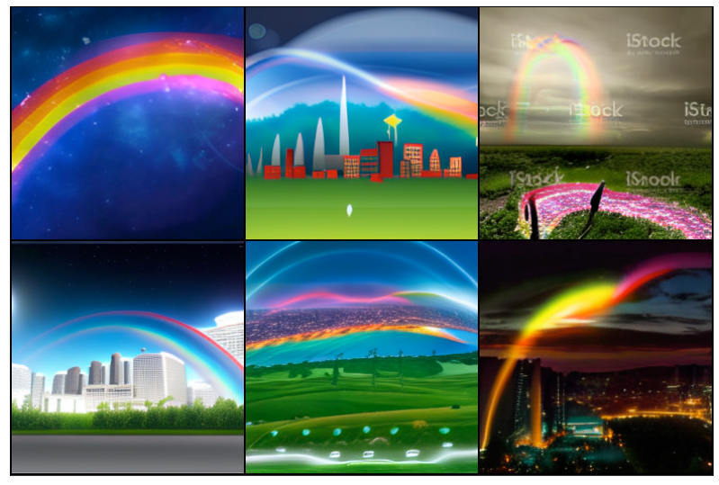
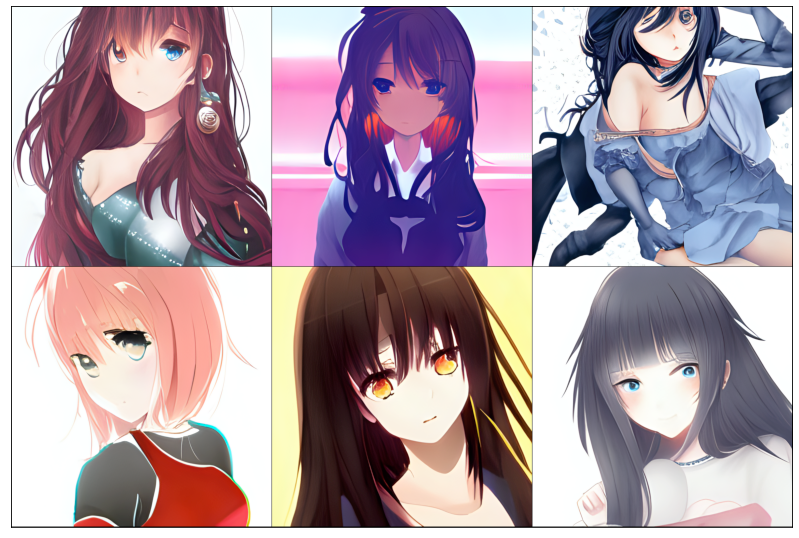

# ruDALL-E
### Generate images from texts

```
pip install rudalle==0.0.1rc3
```
### 🤗 HF Models:
[ruDALL-E Malevich (XL)](https://huggingface.co/sberbank-ai/rudalle-Malevich)

### Minimal Example:

[](https://colab.research.google.com/drive/1wGE-046et27oHvNlBNPH07qrEQNE04PQ?usp=sharing)

[](https://www.kaggle.com/shonenkov/rudalle-example-generation)

### generation by ruDALLE:
```python
from rudalle.pipelines import generate_images, show, super_resolution, cherry_pick_by_clip
from rudalle import get_rudalle_model, get_tokenizer, get_vae, get_realesrgan, get_ruclip
from rudalle.utils import seed_everything

# prepare models
device = 'cuda'
dalle = get_rudalle_model('Malevich', pretrained=True, fp16=True, device=device)
realesrgan = get_realesrgan('x4', device=device)
tokenizer = get_tokenizer()
vae = get_vae().to(device)
ruclip, ruclip_processor = get_ruclip('ruclip-vit-base-patch32-v5')
ruclip = ruclip.to(device)

text = 'изображение радуги на фоне ночного города'

seed_everything(42)
pil_images = []
scores = []
for top_k, top_p, images_num in [
    (2048, 0.995, 3),
    (1536, 0.99, 3),
    (1024, 0.99, 3),
    (1024, 0.98, 3),
    (512, 0.97, 3),
    (384, 0.96, 3),
    (256, 0.95, 3),
    (128, 0.95, 3), 
]:
    _pil_images, _scores = generate_images(text, tokenizer, dalle, vae, top_k=top_k, images_num=images_num, top_p=top_p)
    pil_images += _pil_images
    scores += _scores

show(pil_images, 6)
```

### auto cherry-pick by ruCLIP:
```python
top_images, clip_scores = cherry_pick_by_clip(pil_images, text, ruclip, ruclip_processor, device=device, count=6)
show(top_images, 3)
```

### super resolution:
```python
sr_images = super_resolution(top_images, realesrgan)
show(sr_images, 3)
```


```python
text, seed = 'красивая тян из аниме', 6955
```



### Image Prompt
see `jupyters/ruDALLE-image-prompts-A100.ipynb`
```python
text, seed = 'Храм Василия Блаженного', 42
skyes = [red_sky, sunny_sky, cloudy_sky, night_sky]
```
