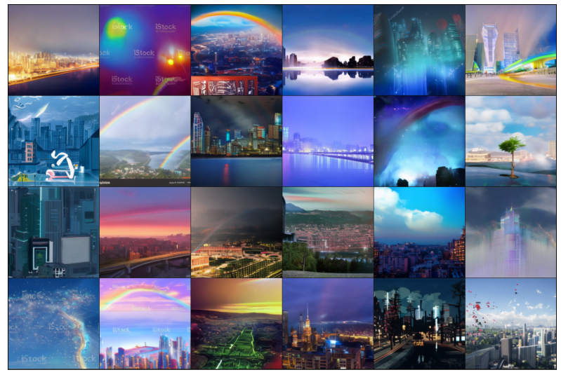
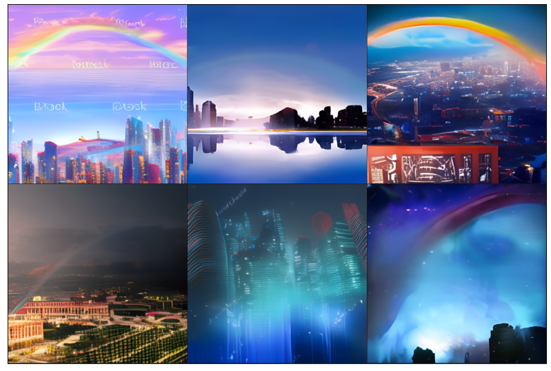

# ruDALL-E
### Generate images from texts

[](https://www.apache.org/licenses/LICENSE-2.0)
[](https://pepy.tech/project/rudalle)
[](https://codecov.io/gh/sberbank-ai/ru-dalle)
[](https://gitlab.com/shonenkov/ru-dalle/-/pipelines)
[](https://results.pre-commit.ci/latest/github/sberbank-ai/ru-dalle/master)

```
pip install rudalle==1.0.0
```
### 🤗 HF Models:
[ruDALL-E Malevich (XL)](https://huggingface.co/sberbank-ai/rudalle-Malevich) \
[ruDALL-E Emojich (XL)](https://huggingface.co/sberbank-ai/rudalle-Emojich) (readme [here](https://github.com/sberbank-ai/ru-dalle/blob/master/Emojich.md))


### Minimal Example:

[](https://colab.research.google.com/drive/1wGE-046et27oHvNlBNPH07qrEQNE04PQ?usp=sharing)
[](https://www.kaggle.com/shonenkov/rudalle-example-generation)
[](https://huggingface.co/spaces/anton-l/rudall-e)

**Example usage ruDALL-E Malevich (XL) with 3.5GB vRAM!**
[](https://colab.research.google.com/drive/1AoolDYePUpPkRCKIu0cP9zV7lX5QGD3Z?usp=sharing)

**Finetuning example**
[](https://colab.research.google.com/drive/1Tb7J4PvvegWOybPfUubl5O7m5I24CBg5?usp=sharing)

### generation by ruDALLE:
```python
import ruclip
from rudalle.pipelines import generate_images, show, super_resolution, cherry_pick_by_ruclip
from rudalle import get_rudalle_model, get_tokenizer, get_vae, get_realesrgan
from rudalle.utils import seed_everything

# prepare models:
device = 'cuda'
dalle = get_rudalle_model('Malevich', pretrained=True, fp16=True, device=device)
tokenizer = get_tokenizer()
vae = get_vae(dwt=True).to(device)

# pipeline utils:
realesrgan = get_realesrgan('x2', device=device)
clip, processor = ruclip.load('ruclip-vit-base-patch32-384', device=device)
clip_predictor = ruclip.Predictor(clip, processor, device, bs=8)
text = 'радуга на фоне ночного города'

seed_everything(42)
pil_images = []
scores = []
for top_k, top_p, images_num in [
    (2048, 0.995, 24),
]:
    _pil_images, _scores = generate_images(text, tokenizer, dalle, vae, top_k=top_k, images_num=images_num, bs=8, top_p=top_p)
    pil_images += _pil_images
    scores += _scores

show(pil_images, 6)
```

### auto cherry-pick by ruCLIP:
```python
top_images, clip_scores = cherry_pick_by_ruclip(pil_images, text, clip_predictor, count=6)
show(top_images, 3)
```

### super resolution:
```python
sr_images = super_resolution(top_images, realesrgan)
show(sr_images, 3)
```


```python
text, seed = 'красивая тян из аниме', 6955
```


### Image Prompt
see `jupyters/ruDALLE-image-prompts-A100.ipynb`
```python
text, seed = 'Храм Василия Блаженного', 42
skyes = [red_sky, sunny_sky, cloudy_sky, night_sky]
```


### 🚀 Contributors 🚀

- [@bes](https://github.com/bes-dev) shared [great idea and realization with IDWT](https://github.com/bes-dev/vqvae_dwt_distiller.pytorch) for decoding images with higher quality 512x512! 😈💪 thanks a lot for your constructive advices, appreciate it
- [@neverix](https://www.kaggle.com/neverix) thanks a lot for contributing for speed up of inference
- [@Igor Pavlov](https://github.com/boomb0om) trained model and prepared code with [super-resolution](https://github.com/boomb0om/Real-ESRGAN-colab)
- [@oriBetelgeuse](https://github.com/oriBetelgeuse) thanks a lot for easy API of generation using image prompt
- [@Alex Wortega](https://github.com/AlexWortega) created first FREE version colab notebook with fine-tuning [ruDALL-E Malevich (XL)](https://huggingface.co/sberbank-ai/rudalle-Malevich) on sneakers domain 💪
- [@Anton Lozhkov](https://github.com/anton-l) Integrated to [Huggingface Spaces](https://huggingface.co/spaces) with [Gradio](https://github.com/gradio-app/gradio), see [here](https://huggingface.co/spaces/anton-l/rudall-e)

### Supported by

[](https://github.com/sberbank-ai) \
[](https://sberdevices.ru)

[](https://sbercloud.ru/) \
[](https://airi.net)


### Social Media

[](https://habr.com/ru/company/sberbank/blog/589673/)
[](https://habr.com/ru/company/sberdevices/blog/586926/)
[](https://instagram.com/rudalle.official)
